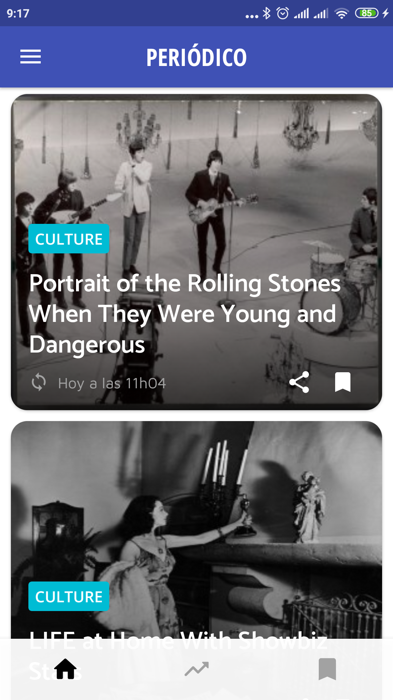
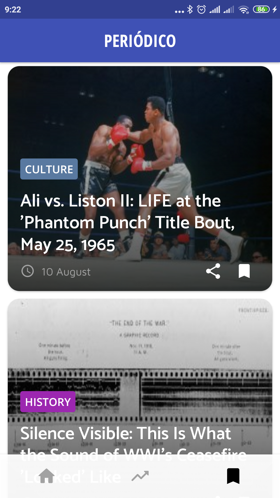
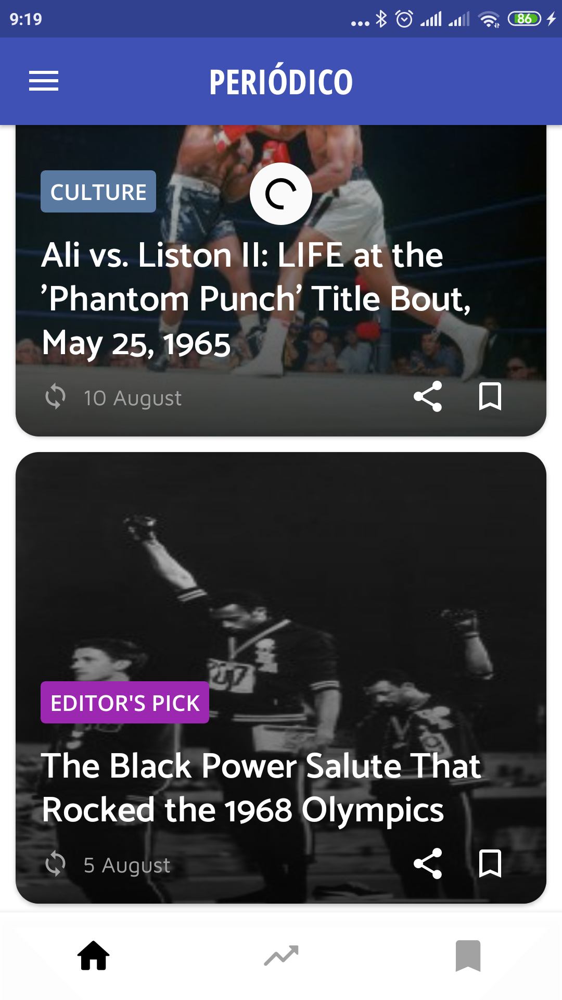
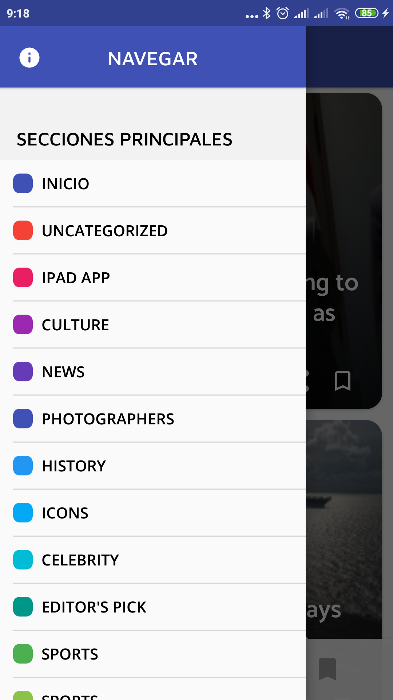
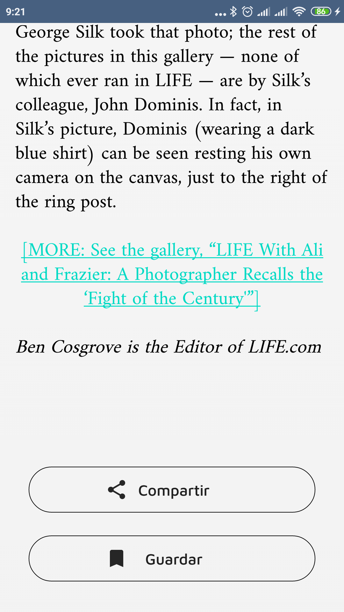

# Periódico Wordpress
## Datos relevantes
El proyecto tiene las siguientes características técnicas:
* Kotlin
* LiveData
* Patrón MVVM
* Volley como cliente HTTP para API
* SDK Mínima Android 5.0 (API 21)
* Se utiliza WordPress 5.4 para las pruebas (API v2)

Como entorno de desarrollo se está usando Android Studio 3.6.2.

## Capturas

